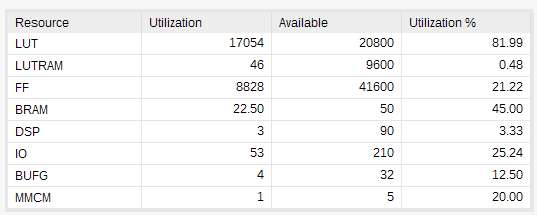

# Weekly Report (Mar 28, 2019)

## ARM SoC on FPGA

Still working on the ARM Cortex-M3 SoC implementation on FPGA.

There are two release version from ARM. 

The content of Xilinx version is encrypted. I am testing them on the FPGA, not successed yet.

As for the Eval version, I have read the top-level system-integration code.
