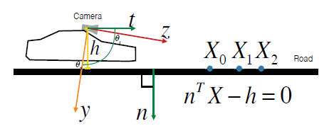

# Monocular Visual Odometry Scale Recovery using Geometrical Constraint
## Introduce

Scale recovery usually use camera height, depends on the accuracy of the road region detection and road geometrical model calculation.

road region detection and road geometrical model estimation can benefit each other.

+ segment an input image use Delaunay Triangulation method.

+ compare with road geometrical model to classify.
+ road geometrical model is updated online.

## Proposed Framework

The key problem : the point on road $n^Tx=h$ , compare relative and absolute scale h to get scale parameter s.

#### Road Region Detect

> use road geometrical constraint instead of color information, more robust

+ 2D points {$u_i$} segmented by Delaunay Triangulation to {Tri}

+ calculate {Tri} geometric model : norm and relative height

  > n has 2 DOF and h has 1
  >
  > solved by  $n^Tx=h$ use 3 matched points

  h > 0 means the Tri below the camera

+ select the road regions

  + h > 0

  + n close to the norm estimate by cam motion $\theta_t$ or $\theta_R$ is big

  + similar to recent frames

    > the distance $d_n=|arccos\mathbf n \cdot \mathbf n_t|$

  + estimate the point in Tri

#### Road Model Estimation

> assume road is flat plane

+ calculate road model use RANSAC 

  > if number of fpoint < 12, skip RANSAC, use the previous model

+ use median filter method

#### Scale Recovery

+ scale parameter calculate by relative and absolute height $s=\frac{h'}{h}$ 

+ point and pose scale recovery by multiply s 

## Result

> use KITTI dataset

compare with ORB-SLAM

use median filter

compare with other scale recovery method

## Code

https://github.com/TimingSpace/MVOScaleRecovery

