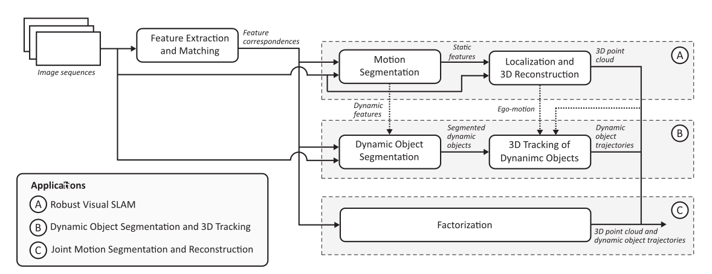
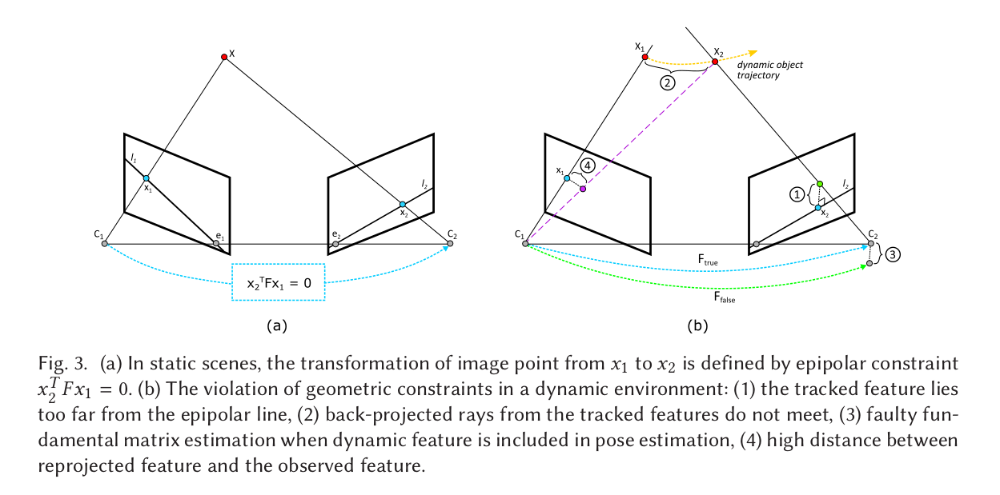
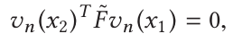
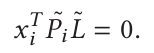
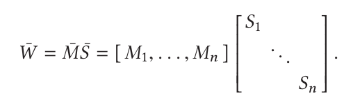

# Visual SLAM and Structure from Motion in Dynamic Environments: A Survey

## Robust Visual SLAM

### Motion Segmentation

using RANSAC to outlier dynamic point

+ B/F initialization

  > need object CAD or CNN prior
  >
  > or need a pure background init (prior)

+ Geo Constraint

  > leverage epipolar geo to segment static&dynamic : will violate standard constraint

  + check epipolar : use Flow Vector Bound when point move along epipolar (TODO)

  

  + check 3 projected rays intersection
  + compute the error between assume new feature is static & without new feature
  + reprojected error : check occluded

+ Optical Flow

+ Ego-Motion Constraint

  > need external information(such as vehicle wheel)

+ Deep Learning

> F/B init : track temporarily stationary, but need prior and non-real-time.
>
> Geo : real-time but affected by geometric errors
>
> Optical-flow : based on the brightness constancy assumption, difficult in handling degenerate motion
>
> Ego-motion : can solve motion degenerate, but need external prior

### Localization and Reconstruction

+ Feature-Based

  > use RANSAC to solve outliers

+ Deep Learning

  > but may only work well in known environment

  + pose estimate employ regression-based CNN
  + flow-based network
  + unsupervised method to minimizing photometric error

## Segmentation and Tracking

### Dynamic Object Segment

correspondences with features and object (EM) 

Problem : noise, occlusion, motion blur, losing, degenerate motion...

+ Statistical Model Selection

  > each object has a motion model (E, F, H, A) 
  >
  > model selection use RANSAC, iteration on remaining data, AIC to score

+ Subspace Clustering

  > high-dimensional data can be represented by low-dimensional subspaces feature.
  >
  > subspace separation by principle of statistical, select the best subspace configuration by AIC, employed outlier by least median of squares

  

+ Geo

  > n Fundamental matrix describe n object, 1 for static feature (multi-body epipolar constraints)

  

  Then recovery $F_i$ by polynomial factorization

+ Deep Learning

  > rely on a predefined number of rigid body motions
  >
  > predict object mask and SE(3) transformation

> Statistical model : fitting a motion model from randomly sampled data is computationally expensive
>
> Subspace : need whole sequence, non-real-time, only work in affine transform
>
> Geo : cannot handle degenerate motion, need too much image pairs

### 3D Tracking

> back-projected rays do not intersect in standard vslam

+ Trajectory Triangulation

  > assume object move as a line
  >
  >  finding a 3D line that intersects projected rays from t views
  >
  > at least need 5 views

  

  

+ Particle Filter

  > respect as a Bearing-only-Tracking problem, which can solve by filter-based approach

> trajectory triangulation : need trajectory model assume(line), need 5 or 9 views
>
> filter : real-time, need constant v assume

## Joint Segmentation & Reconstruction

### Factorization

> segmentation and reconstruction simultaneously
>
> a measurement matrix is at most of rank four

Factorization feature matrix to motion and shape matrix use SVD

+ Multi-body SFM

> the entry of shape matrix is zero if feature trajectory a and b belong to different objects
>
> motion segmentation and reconstruction can be done by thresholding the entries

+ Nonrigid SFM

> factorization-based approach : most apply in affine, non-real-time, sensitive to noise

