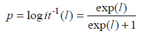

# DS-SLAM : A Semantic Visual SLAM towards Dynamic Environment

## Introduce

+ reduce the dynamic object(people) influence based on ORB_SLAM in ROS
+ real time semantic segmentation SegNet 
+ build dense semantic 3D octo-tree map

## Proposed Framework

+ Overall framework

  

  5 parallel thread in DS-SLAM : tracking, semantic segmentation, loop closure, dense 3D reconstruction.

  > raw RGBD images captured by Kinect2

+ Moving Consistency

  1. calculate optical flow pyramid to get matched pints pairs
  2. discard pair close to edge or difference is large
  3. calculate F by RANSAC and epipolar
  4. determine the distance between point and epipolar less than threshold

+ Semantic Segmentation

  > SegNet trained on VOC dataset could segmentation 20 classes

  1. first check moving consistency of feature points save as potential outliers
  2. if lots outliers in object, the object is determined to be moving
  3. then remove all points in this object
  4. regard points in human as dynamic
  5. calculate the pose by static point pairs

+ Dense 3D semantic reconstruction

  1. use keyframe and depth images to generate pcl
  2. convert pcl to octo-tree represents
  3. each voxel associate with semantic information

+ segmentation result to filter and track dynamic object

  > use log-odds score to object overlap segmentation result may wrong

  Lt equal to 1 if the voxel n is observed to be occupied at time t , otherwise 0

  the log score l is increase when the voxel is repeatedly observed to be occupied (Lt=1)

  

  calculate p from log odds score

  > p denote probability of a voxel, l denote log odd score

  Only when p is greater than threshold, the voxel visualized in octo-tree map

## Result

+ on dataset

+ on real environment

