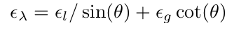

# Direct Monocular Odometry Using Points and Lines

## Introduce

edge detect is less sensitive  to light change

+ maintain a semi-dense map for key-frame high gradient pixel.
+ detect and match edge every frame
+ joint optimize both photometric and geometric error
+ speed up stereo search and improve depth quality by edge regularizing

## Proposed Framework

detect line segments and match them with the key-frame edges

camera pose tracking

update the depth map through variable baseline stereo

#### Tracking

the depth map of the reference frame is assumed to be fixed

use LBD descriptor to match line

to minimize photometric residual and line re-projection geometric error(if pixel belong to edge) use Gauss-Newton

information matrix 

#### Mapping

camera pose is assumed to be fixed

depth map updated through stereo triangulation followed by line regularization

Regularization to improve the depth estimation accuracy

+ stereo triangulation

+ uncertain analysis

​	Then do EKF update pixel depth

+ line regularization

  

  use RANSAC to select a set of inlier 2D points

## Result

