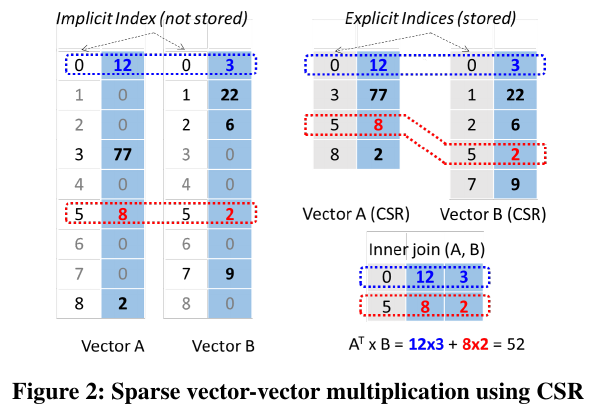
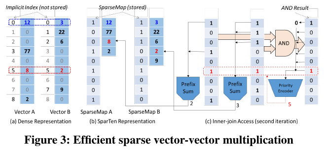
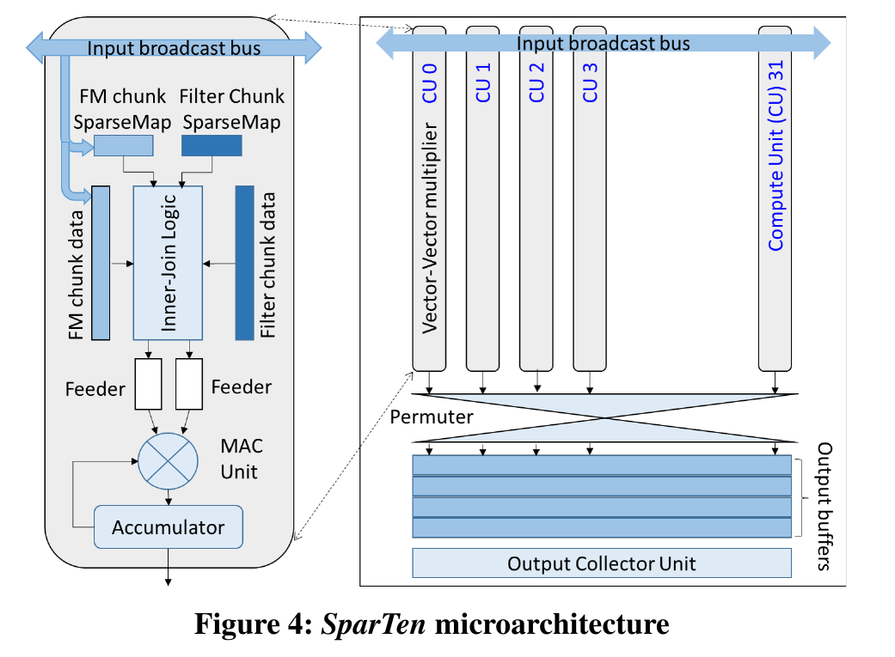
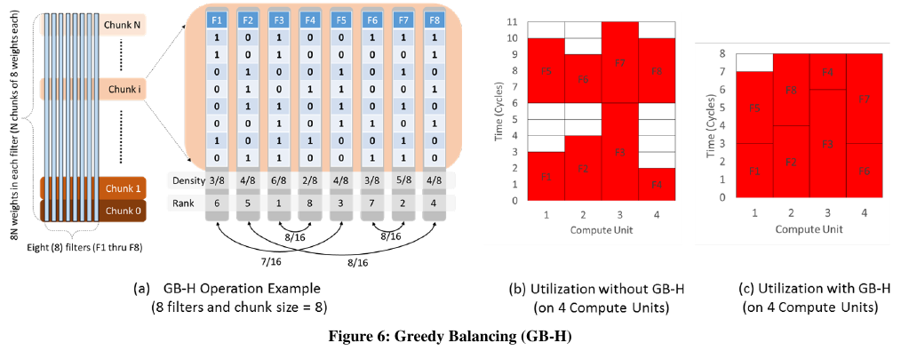

#SparTen: A Sparse Tensor Accelerator for Convolutional Neural Networks

##ABSTRACT
While previous semi-sparse architectures exploit one-sided sparsity either in the feature maps or the filters, but not both, a recent fully-sparse architecture, called Sparse CNN (SCNN), exploits two-sided sparsity to improve performance and energy over dense architectures. 

SCNN avoids the inner join by performing a Cartesian product capturing the relevant multiplications.However, SCNN’s approach incurs several considerable overheads and is not applicable to non-unit-stride convolutions. 

To tackle load imbalance, SparTen employs a software scheme, called greedy balancing, which groups filters by density via two variants, a software-only one which uses whole-filter density and a software-hardware hybrid which uses finer-grain density.

##SPARTEN
SparTen makes two contributions. 
First, SparTen achieves efficient inner join by providing support for native two-sided sparse execution and memory storage, instead of avoiding the inner join like SCNN. 
Second, to address load imbalance while achieving full reuse, SparTen employs an offline software scheme called greedy balancing.

###Efficient inner join

SparTen uses a bit-mask representation where a sparse tensor is a two tuple of a bit mask, called SparseMap, and a set of non-zero values. 
The SparseMap has 1’s for positions with non-zero values and 0’s otherwise (Figure 3). For ease of implementation, tensors are broken up into chunks of n positions to give n-bit SparseMaps and the corresponding (variable number of) non-zero data values.

Surprisingly, the bit-mask representation is also space- efficient in addition to being compute-efficient.
shorter run lengths achieve higher compression (e.g., run length of 4 requires 2 bits) but incur (1) redundant pointers for strings of zeroes longer than the run length, making representation efficiency depend on the sparsity and zero run-length distribution and (2) redundant zero compute for such redundant pointers. Simple bit-mask representation avoids these overheads.

The data is held in two parts: the first part comprises an array of two tuples each of which is a chunk’s SparseMap followed by a pointer to the chunk’s non-zero data values.
The array is as long as there are chunks in a filter or feature map. There are three such arrays for each layer, one each for (a) all the filters, (b) the input map, and (c) the output map. 

SparTen supports native two-sided sparse execution which retrieves, consumes, produces, and stores only non-zeros.

##SparTen microarchitecture

SparTen employs asynchronous compute units (left in Figure 4). Each compute unit, comprising a multiplier, an accumulator, the inner join circuitry (Section 3.1), and buffers for inputs and output, performs a sparse vector-vector dot product.

To capture both filter reuse across input maps and input map reuse across filters, each compute unit has a local buffer to hold a filter chunk which is reused across multiple input map chunks. 

At the start of a CNN layer, the CPU instructs each compute unit of a cluster to fetch and hold a chunk of a filter (SparseMaps and non-zero data values). The CPU then issues a fetch of an input map chunk from on-chip or off-chip memory which is broadcast to the cluster’s compute units which then computes the filter-map dot product using the inner join circuitry. Each compute unit locally accumulates an output cell’s partial sum as more input channels may remain to be processed (Figure 4). The CPU then issues the rest of the input chunks to each compute unit to complete its output cell, including any ReLU operation which may results in a zero. Consecutive compute units produce consecutive output channels. An output collector collects each compute unit’s output, discards zero values, and on-the-fly produces a sparse output tensor (SparseMap and non-zero data values) broken up into chunks (Figure 4).

##Greedy balancing

