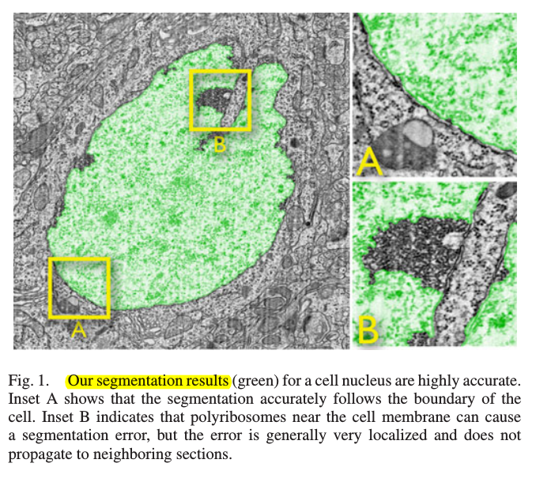
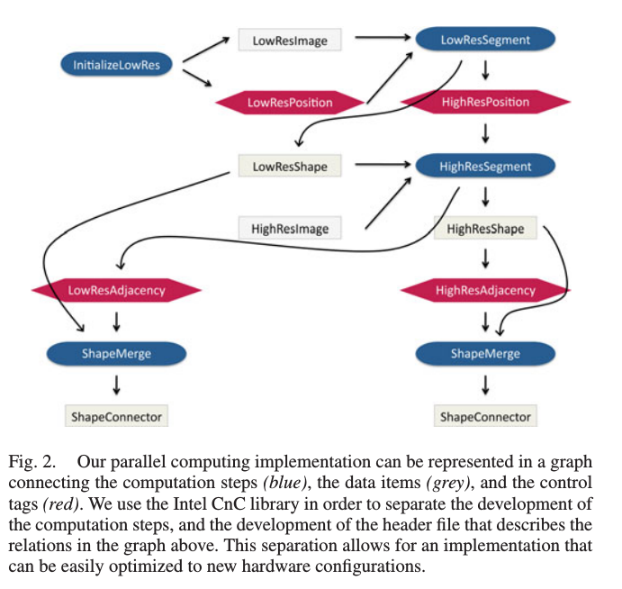
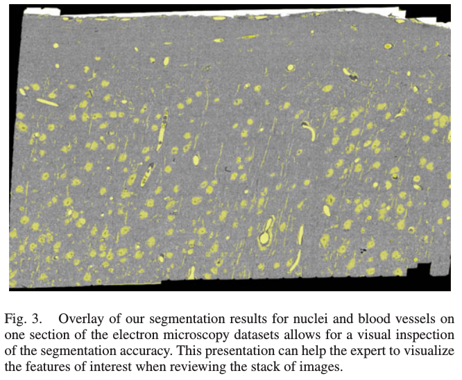
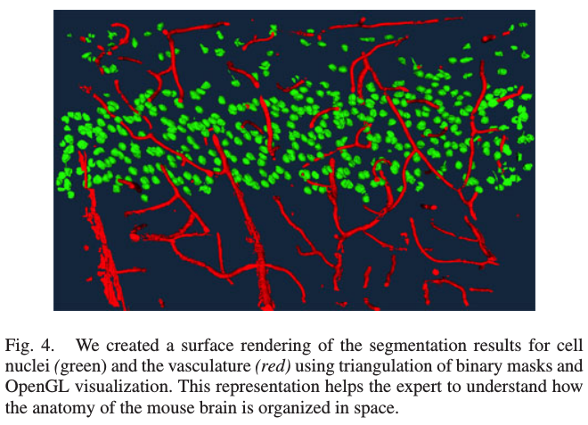

# A Multiscale Parallel Computing Architecture for Automated Segmentation of the Brain Connectome

This paper proposes to scale up the tracing by using automated image segmentation and a parallel computing approach designed for domain experts.

## INTRODUCTION

BAD::
Manual tracing efforts by teams of up to 70 trained biologists working for several months have led to the analysis of a portion of these datasets.
Creating a complete connectome using such a labor-intensive method would require several decades and is unlikely to scale up with the size of future datasets.

In order to reduce this time frame to the order of days, 
we propose to combine robust segmentation techniques and a flexible, parallel computing approach. We first describe our segmentation algorithm as we apply it on subvolumes of the volumetric dataset.

##  SEGMENTATION ALGORITHM FOR SUBVOLUMES

Our segmentation algorithm is a sequence of automated image operations performed on multiscale subvolumes: extraction of subvolumes, local image filtering, and robust connected component analysis.

### 1.Extraction of Multiscale Subvolumes

The size of a subvolume depends on the scale of the feature of interest.

We create subvolumes, also called ghost volumes, that overlap by at least half the maximum diameter of the feature of interest.

### 2.Local Image Operations

First, we manually segment the feature of interests in three randomly selected subvolumes and per form an histogram analysis for the different features.
Then we select the intensity threshold that results in the minimum misclassification.
Finally, since small clusters of pixels are typically noise, we remove them and fill the holes within large clusters of pixels

### 3.Data Recovery and Connected Components Analysis

First we sum up the intensity of pixels across Z stacks of N/10 sections.
Since the previous operations produced binary sections, the pixel intensity within each section is either 0 or 1.
Then, if the total intensity of a pixel after the summation is larger than N/20 , the pixel is classified as belonging to a feature of interest. 
Finally, we perform a 3-D connected components analysis, compute their respective number of pixels, and threshold out the smaller components.

## PARALLEL COMPUTING APPROACH

CnC:
only the signatures of the computation methods are modified,
only a small header file describing the relations between data items and computation methods, also called computation steps, is added.

### Subvolume Items and Segmentation Steps
data items are the image subvolumes
computation steps are the segmentation methods for the different features of interest.
Every image subvolume is indexed by a triplet i, j, k, which we call a subvolume control tag.

The segmentation method will consume a pair of subvolume control tag and subvolume data item. The method is then triggered and upon its execution it will produce a set of segment data items, where the entire set is indexed by a segment set control tag x, y, z, where x = i, y = j, z = k

### Segment Sets and Merge Steps

To connect segments across neighboring subvolumes.
a merge method that compares the segments across subvolumes, and connects the segments that overlap. 
merge method thus consumes a segment set control tag and produces a connectivity tag (u, v, w, a, id)
where u = x, v = y, w = z, a ∈ 1, 2, 3 defines the direction of the neighboring subvolume (+X axis, +Y axis or +Z axis), id is the id of the segment in the second subvolume.

###  Reconstruction Step

Upon completion of all the merge steps, a reconstruction step is executed to create the segmentation results for the entire dataset. 
This light-weight step simply follows the list of connectivity tags and puts together the segments that overlap partially.

## RESULTS

The overlay of our segmentation results on one section of the dataset 

A surface rendering in 3-D 

### Data Size and Computation Time
 
The digitized section composed after mosaicking and alignment of the camera images has a length of 135 200 pixels and a width of 119 600 pixels. 
The total size for the uncompressed dataset is approximately 19 terabyte.

Each subvolume was 3250 pixel by 3250 pixel in-plane and 50 sections high. The overlap margin was 650 pixels in the −X, +X, −Y, and +Y directions, and the overlap in −Z and +Z was five sections.

The total computation time for the entire 19 terabyte dataset was two days and 10 h.

### Computation Speedup

we performed an experiment on a subset of the dataset.
The execution of the serial implementation took 1 h and 26 min, while the execution of the parallel implementation took 14 min, resulting in a 6.14 speedup factor.

Given that our hardware had two quad-core processors, the maximum speedup factor would be 8. 

