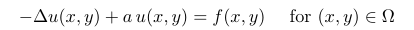
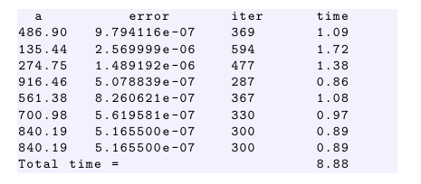
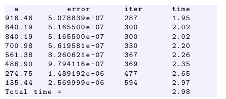
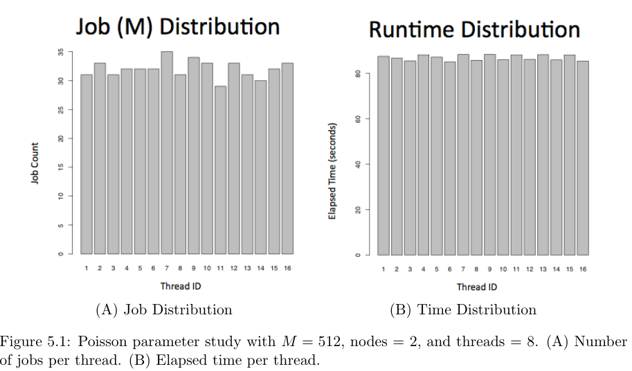
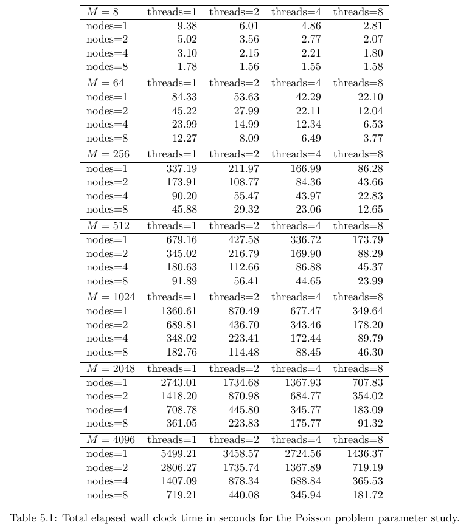
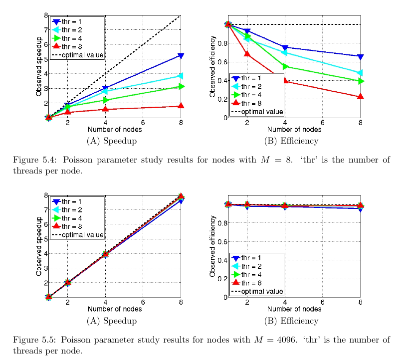

# Cluster Computing using Intel Concurrent Collections

## Abstract
The present work focuses on the distributed version of CnC, where parallel code is run across multiple compute nodes.

Specific accomplishments included 
getting distributed CnC working on the cluster tara in the UMBC High Performance Computing Facility, 
running timing tests, 
analyzing the data, 
and creating a generalized portable version of the distributed CnC code.

This work allows a user in the distributed mode to have independent control over the number of threads, cores, and nodes to be used by a program

## Introduction

BAD MPI
Message Passing Interface (MPI) requires the programmer to explicitly declare what data gets sent and received by what process. 
MPI also provides methods to determine how many processes the code will run on and a designating number of the current process that is executing code. 

This adds another unwelcome layer of  omplexity to parallel programming

GOOD CnC
Instead of explicitly sending messages to processes the way MPI does, CnC uses a system of collections comprised of steps, items, and tags.
A user specifies the work to be done and CnC automatically sends to the work out to the processes. 

BUT ???
The nature of CnC’s parallelization makes operations that require accessing parallel elements in order counter productive and time costly. 
But CnC excels at parameter studies where multiple runs of a method each may vary in memory and run-time in unknown ways [1].

## Using CnC on Tara at UMBC (cluster)

The UMBC High Performance Computing Facility, has an 86-node distributed-memory cluster, consisting of 82 compute nodes, 2 development nodes, 1 user node, and 1 management node.
Each node has two quadcore Intel Nehalem X5550 processors (2.66 GHz, 8192 kB cache) and 24 GB of memory. All components are connected by a state-of-the-art InfiniBand (QDR) interconnect.

## Poisson Equation

For this parameter study, the problem solved was the partial differential equation (PDE)

## asdasd

First shown are results from running this Poisson code with eight different a values, on an N × N mesh with N = 512, using a single thread. This is output captured directly from stdout after running the program:

Next, are the same eight a values (generated by the random number generator using the same seed) on 8 threads:

It is noticeable that there is an overhead associated with using CnC on several threads, since each individual time for the Poisson function is larger than when using only one thread. 
But it is also apparent that the total wall clock time is only slightly longer than the time from the longest process. 
This shows that the parallelization was effective in decreasing the total run time to as small as possible, namely controlled by the slowest thread.

## Distributed CnC: Multi-Threading on Several Nodes

The distributed version of CnC, called Distibuted CnC required a tuner struct to be written in the CnC header file.
The tuner is what allows for individual jobs to be sent between nodes. 
The tuner used for the Poisson problem used a round-robin method for distributing jobs among nodes.

An example of the round robin method worked for the Poisson parameter study would be the run with 4096 jobs using 8 nodes. 
Each node could be viewed as a separate non-distributed CnC parameter study with 512 jobs.
That is due to the fact that while jobs were manually assigned to each node, CnC still automatically distributed all jobs within that node to the respective cores and threads.

Table 5.1 shows the raw timing data in seconds for each M size’s elapsed run-time given a certain number of threads and nodes. 

In general, increasing the number of threads only brings 50% of the expected speed up.
In contrast, increasing the number of nodes brings about almost 100% of the expected speed up. 
By combining both multiple nodes and multiple threads, Distributed CnC can achieve impressive speedups.

testing shows that while parallelization within a single node is only around 50% to 60% effecient, parallelization across multiple nodes is around 100% efficient. Combining the speed up produced by both nodes and threads prove that Distributed CnC is a great improvement to the existing CnC system.

