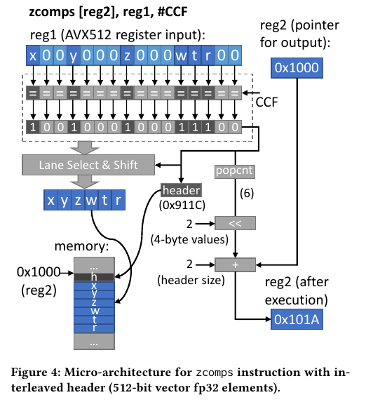
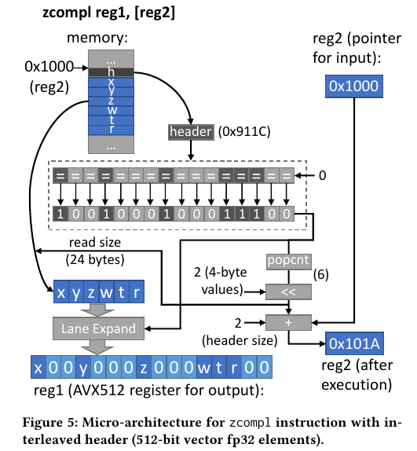

# ZCOMP: Reducing DNN Cross-Layer Memory Footprint Using Vector Extensions

## ABSTRACT

BAD
apply intense pressure on the capacity and bandwidth of the memory hierarchy, primarily due to the large intermediate data communicated across network layers.
dynamically compressing/expanding such data is a challenging task for general-purpose multi-processors with virtual memory and hardware-managed coherent cache hierarchies.

This Paper
propose ZCOMP, a CPU vector ISA extension tailored for DNN cross-layer communication.
ZCOMP compactly represents zero value compression/expansion and fully automates the metadata generation, storage and retrieval which eliminates the need for several extra instruction executions and register usage

## INTRODUCTION

Our proposed techniques are motivated by the following two key observations:
First, feature maps produced by DNN layers often include large populations of zero value activations interspersed with non-zero activations.
Second, feature map accesses almost always exhibit perfect streaming patterns, whereby activation data is sequentially written by one layer and later read sequentially by another layer, without requiring random element retrievals.

The function of ZCOMP is to dynamically compress/expand data in a memory region before being written/read to/from the memory hierarchy.
It provides high-throughput parallel execution, transparent interactions with caches and virtual memory,

##  ZCOMP MICRO-ARCHITECTURE

We define two new ZCOMP instructions:
zcompl and zcomps. 
zcompl is used to load and decompress the elements, whereas zcomps compresses and stores them.

We next describe two different variants of zcompl and zcomps: (i) interleaved header and (ii) separate header.

###  Interleaved Header zcomps and zcompl

#### zcomps

Interleaved-header zcomps requires two input registers (reg1 and reg2) and a comparison condition flag (CCF). 

It takes the input vector via the reg1 register operand (e.g. a 512-bit SIMD register),
and stores the compressed version into the memory region starting from the location pointed by the reg2 operand,
The comparison flag can be configured to simply check if the elements are zero valued.

The result of the CCF vector comparison creates a mask with 1 bit per element that will represent the compression metadata (i.e. header in Figure 4).
Meanwhile, the number of uncompressed values in the vector is calculated.

The final output to be written into memory is formed by concatenating the header and the selected uncompressed elements sequentially. 

#### zcompl

zcompl takes two input registers: reg1 and reg2,

reg1, is the destination register (e.g. 512-bit SIMD register) to which the loaded vector will be expanded
reg2, is the source pointer for the loaded vector.

###  Separate Header zcomps and zcompl
The interleaved header approach aims to fit headers and the compressed data into the original memory space.

However, if the compressibility of the data is completely unknown, separately and explicitly allocating memory for the metadata is desirable.

But instead of two input register operands, we need three inputs for separate-header instructions
The additional register reg3 holds the pointer to the separated header store. 

