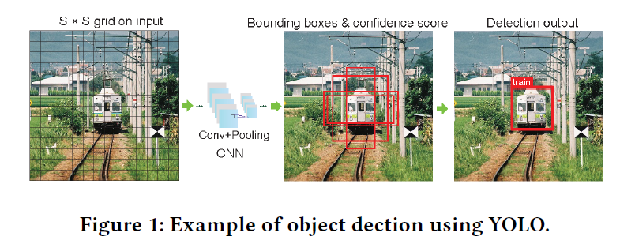
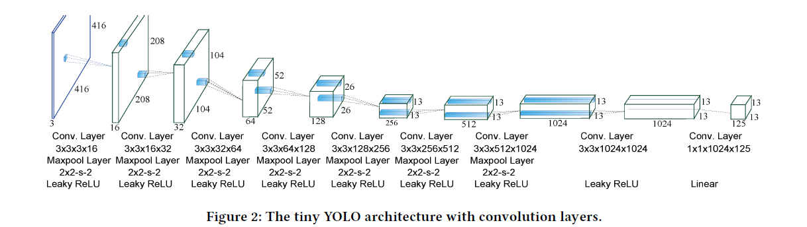
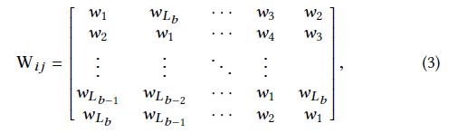
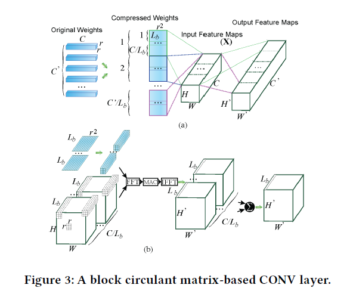
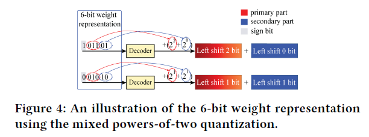
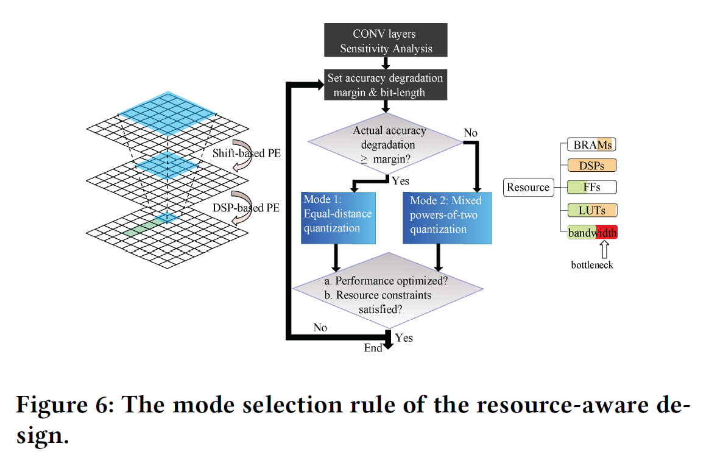
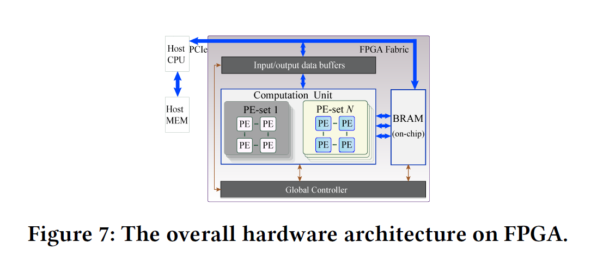
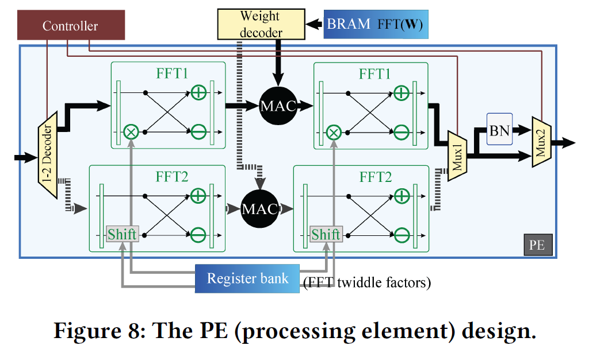

# REQ-YOLO: A Resource-Aware, Efficient Quantization Framework for Object Detection on FPGAs

## ABSTRACT

To achieve real-time, highly-efficient implementations on FPGA:

we present the detailed hardware implementation of block **circulant matrices** on CONV layers and develop an efficient processing element (PE) structure supporting the **heterogeneous weight quantization**, CONV dataflow and pipelining techniques, design optimization, and a template-based **automatic synthesis framework** to optimally exploit hardware resource.

## Tiny-YOLO

## Block-Circulant Matrices

Circulant matrices, where each row/column is the cyclic reformulation of the others, as shown in Equantion (3).

where Lb represents the row/column size of each structured matrix (or block size, FFT size).

## THE REQ-YOLO FRAMEWORK

### HeterogeneousWeight Quantization

Propose a heterogeneous weight quantization technique:

1. Adopt the **equal-distance** **quantization** for some CONV layers
2. Use the mixed **powers-of-two-based quantization** for other CONV layers

### ADMM for Weight Quantization

## HARDWARE IMPLEMENTATION

### FPGA Resource-Aware Design Flow

The resource usage model including Look-up tables (LUTs), DSP blocks, and BRAM of an FPGA implementation can be estimated using analytical models.

According to our design, there are **two types of PE**s: **DSP-based PE for equal distance quantization** and **shift-based PE for mixed powers-of-two quantization**.

In order to reduce the accuracy degradation as much as possible, our priority choice is equal-distance quantization in those CONV layers which **sensitivity are beyond the pre-set margin value** since we can use DSPs for multiplication operations to enhance the accuracy.

### Overall Hardware Architecture

## CONCLUSION

In this work, we propose REQ-YOLO, a **resource-aware**, **systematic weight quantization** framework for object detection, considering both algorithm and hardware resource aspects in object detection.
We adopt the **block-circulant matrix** method and we incorporate **ADMM** with FFT/IFFT and develop a **heterogeneous weight quantization method** including both **equal-distance and heterogeneous**
**quantization methods** considering hardware resource. We implement the quantized models on the state-of-the-art FPGA taking advantage of the potential to store the whole compressed DNN models on-chip. To achieve real-time, highly-efficient implementations on FPGA, we develop an efficient **PE structure supporting both equal-distance and mixed powers-of-two quantization methods**, CONV dataflow and pipelining techniques, design optimization techniques focus on reducing memory access and PE size/numbers, and **a template-based automatic synthesis framework** to optimally exploit hardware resource. Experimental results show that our proposed framework can significantly compress the YOLO model while introducing very small accuracy degradation. Our framework is very suitable for FPGA and our FPGA implementations outperform the state-of-the-art designs.

