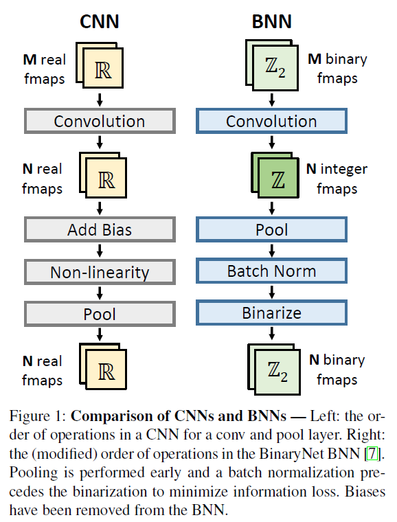
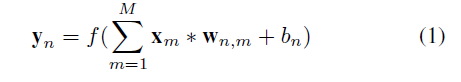
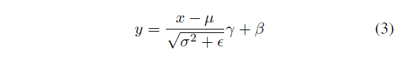
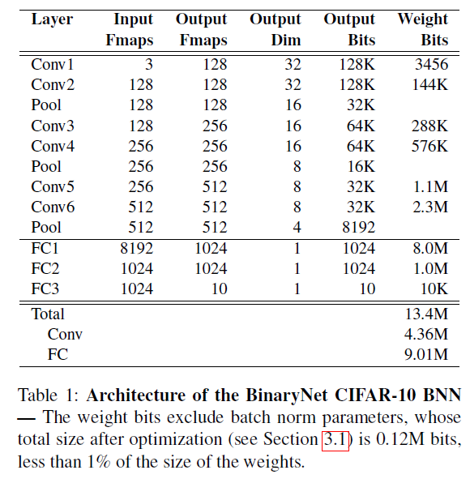
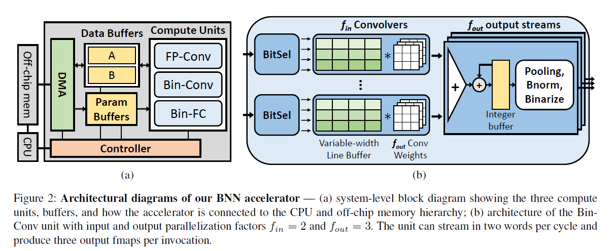
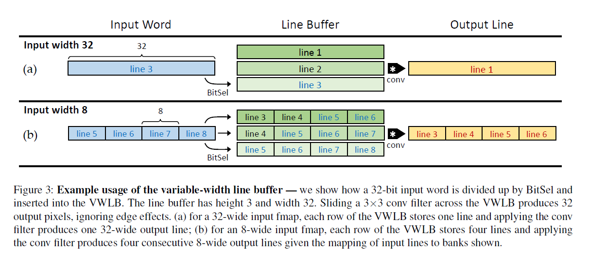

# Accelerating Binarized Convolutional Neural Networks with Software-Programmable FPGAs

## Abstract

In this paper, we present the design of a BNN accelerator that is synthesized from C++ to FPGA-targeted Verilog.

## Preliminaries

### Convolutional Neural Network Primer

### Binarized Neural Networks

The convolution operation in Equation (1) (which nominally requires a K x K element multiply-accumulate)
can now be implemented as a bitwise XNOR between two K x K bit vectors and a popcount.

**Batch normalization** [11] layers reduce the information lost during binarization by linearly shifting and scaling the input distribution to have zero mean and unit variance.

where **x** and **y** are input and output, respectively, **μ** and **σ** are statistics collected over the training set, 
**γ** and **β** are trained parameters, and **ε** is to avoid round-off problems.

### CIFAR-10 BNN Model

## FPGA Accelerator Design

### Hardware Optimized BNN Model

A key optimization we made to the BNN model is parameter quantization. 

While the weights are already binarized, the biases and batch norm parameters are real numbers.

we noticed that nearly every **bias was much smaller than 1**. Given that the inputs have magnitude 1, we
tried setting the biases to zero and observed no effect on accuracy.
We then retrained the network with biases **removed** from the model.

the **batchnorm calculation** (Equation (3)) is a linear transformation, and can thus be formulated as 

​										y = kx + h

### System Architecture

consists of **three compute units**, **data and weight buffers**, a direct memory access (**DMA**) system for off-chip memory transfer, and an FSM **controller.**

FP-Conv unit for the (non-binary) first conv layer.

### Compute Unit Architectures

#### FP-Conv

While the input pixels are 20-bit fixed-point, **the weights are binarized**, so we can replace the multiplies in the conv operation with **sign inversions**.

#### Bin-Conv

We introduce two new modules:
the **BitSel** module and the **variable-width line buffer** (VWLB).

The BitSel and VWLB provides three primary advantages:

1. the VWLB achieves full hardware utilization regardless of input width,
2. a new input word can be buffered every cycle
3. the BitSel deals with various input widths by itself, allowing the actual buffer and convolution logic to be fixed.

## Conclusions and Future Work

We are the first to implement **an accelerator for binarized neural networks on FPGA**. BNNs feature potentially reduced storage requirements and binary arithmetic operations, making them well suited to the FPGA fabric. However, these characteristics also render CNN design constructs such as input tiles and line buffers ineffective. We introduce new design constructs such as **a variable-width line buffer** to address these challenges, creating an accelerator radically different from existing work. We leverage modern **HLS tools** to write our design in productive, high-level code, and our accelerator outperforms existing work in raw throughput, throughput per area, and throughput per Watt.